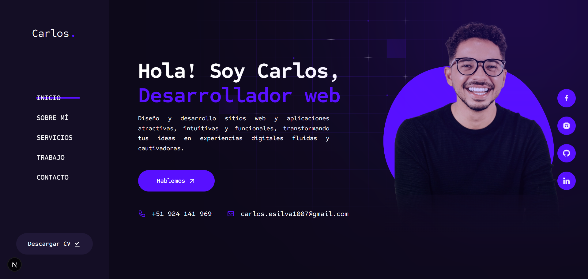

# 💼 Portfolio CESB

[](https://portfolio-cesb.netlify.app)

Bienvenido a **Portfolio CESB**, mi espacio digital donde presento proyectos desarrollados con pasión por el diseño y la tecnología, este portafolio es una muestra de mis habilidades en **desarrollo frontend y full stack**, combinando interfaces modernas con código optimizado y funcional, cada sección está pensada para ofrecer una navegación fluida y mostrar el valor de cada proyecto, desde **landing pages interactivas** hasta **aplicaciones web completas**.

---

## 🌟 **Características Principales**

- 🎯 **Presentación clara y profesional** de proyectos personales y colaborativos.
- 📱 **Diseño responsive** adaptado a todo tipo de dispositivos.
- ✨ **Animaciones fluidas** gracias a Framer Motion.
- 🎨 **UI moderna y consistente** con Tailwind CSS y componentes Radix UI.
- 🚀 **Optimización SEO y rendimiento** aprovechando las capacidades de Next.js.
- 🗂️ **Filtro de proyectos por categoría** para explorar más fácilmente.

---

## 📌 **Proyectos Destacados**

| Proyecto | Descripción | Tecnologías |
|----------|-------------|-------------|
| **EShop CESB** | Landing page moderna para tienda de tecnología. | React, Tailwind CSS |
| **Event Horizont** | Plataforma para descubrir eventos y experiencias. | React, Tailwind CSS, Next.js |
| **Tripi Travel** | Portal de viajes con reservas y alojamiento. | React, Tailwind CSS, Next.js, TypeScript |
| **Shop Cart** | Página de ventas de productos deportivos y para el hogar. | React, Bootstrap, Sass |
| **Mesa de Partes** | Sistema administrativo full stack para gestión documental. | PHP, MySQL |

---

## 🛠️ Tecnologías Utilizadas 👨‍💻

| HTML | CSS | JavaScript | React | Tailwind CSS | Next.js | Node.js |
|------|-----|------------|-------|--------------|---------|---------|
|  |  |  |  |  |  |  |

---

## 🚀 Instalación y Uso Local

Sigue estos pasos para clonar y ejecutar el proyecto en tu máquina local:

1. **Clona el repositorio:**

   ```bash
   git clone https://github.com/carlossilvadev10/portfolio-cesb.git
   ```

2. **Entra en el directorio del proyecto:**

   ```bash
   cd event-horizont
   ```

3. **Instala las dependencias necesarias:**

   ```bash
   npm install
   ```

4. **Ejecuta la aplicación en entorno de desarrollo:**

   ```bash
   npm run dev
   ```

5. **Abre tu navegador y visita:**

   ```bash
   http://localhost:3000
   ```

---

## 📩 Contacto

Si tienes alguna pregunta o sugerencia, puedes encontrarme en:

- 🌐 [Mi GitHub](https://github.com/carlossilvadev10)
- 📧 Email: [carlos.esilva1007@gmail.com](mailto:carlos.esilva1007@gmail.com)
- 💼 [Mi LinkedIn](https://www.linkedin.com/in/carlos-eduardo-silva-bustamante-b6084528b?utm_source=share&utm_campaign=share_via&utm_content=profile&utm_medium=android_app)

---

✨ Gracias por visitar **Portfolio CESB**. ¡El siguiente proyecto podría ser el tuyo!